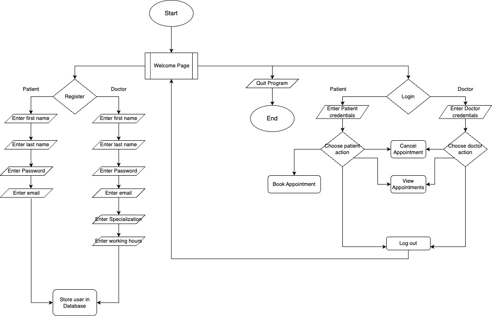
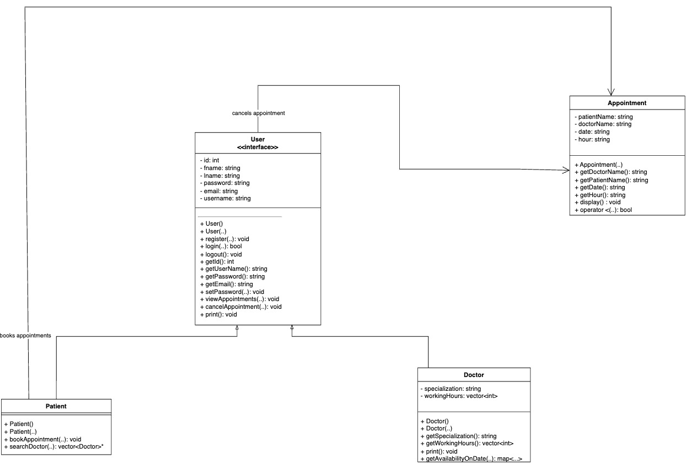

# Approach

The Clinic Appointment Management System is a comprehensive console application designed to facilitate efficient scheduling and management of appointments within healthcare settings. Since this is a console application, users can navigate through it by entering values corresponding to the functionalities printed to them on the console.

The system offers users the ability to register either as doctors or patients, requiring essential credentials such as first name, last name, email, and password during the registration process. For doctors, an additional step involves entering a verification token provided by their affiliated healthcare institution, alongside specifying their working hours to streamline scheduling. The token requirement serves as a crucial step to ensure that only accredited medical professionals are granted access to the system, maintaining the integrity and trustworthiness of the healthcare services provided.

Once users have successfully registered, they are redirected to the welcome page of the system, where they are prompted to log in with their credentials to access the system's functionalities. At this stage, users, whether doctors or patients, are required to enter their username (firstName lastName) and password to securely authenticate their identity and gain access to the system. This login process ensures that only registered users can interact with the system's features.

All users are allowed to register, given they provide the correct requested input. Then again, all users are allowed to log in and out of the system once registered. Registered patients will be able to book and cancel appointments they already booked. During appointment booking, patients are asked to search for a particular doctor or specialization of a doctor they are looking for. Once the search is initiated, the system either returns matches to the search query provided or a list of all doctors if there are no matches. The patient then selects a doctor from whichever list the system presents to them to book an appointment.

The system prompts the patient to enter the date of the appointment and displays the selected doctor's availability on that date. The patient is then asked to select an "available" hour in range to successfully book an appointment. Here, the system intrinsically checks for the same appointment not to be booked twice as that hour will be flagged as booked if it has already been booked. Once an appointment is booked, an Appointment object is created to hold the details of the appointment. Both patients and doctors in the system will have the ability to view all appointments they have booked. To cancel appointments, both Doctors and Patients are presented with all appointments they are associated with and then prompted to select which one they want to cancel. Once canceled, an appointment is deleted from the appointments database.

Activity diagram for the system:

## Class diagram for the system

